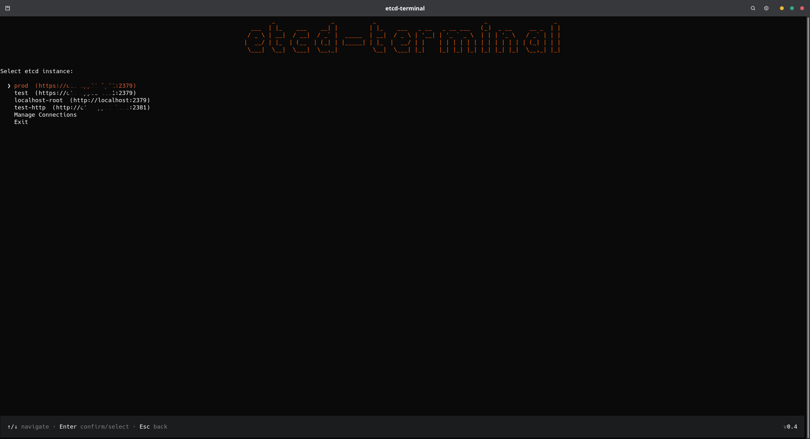
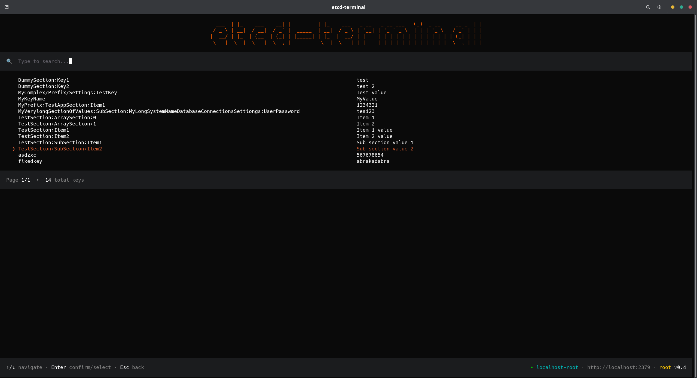
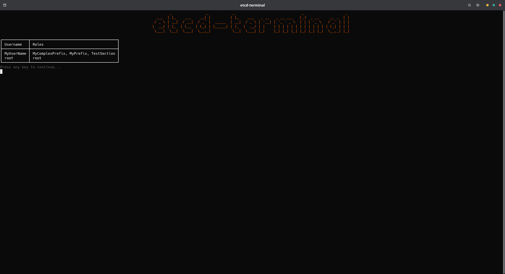
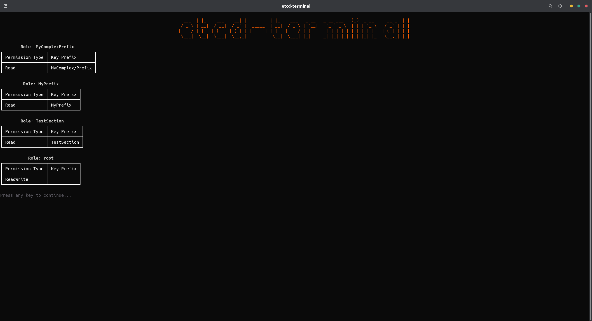

# etcd-terminal

**etcd-terminal** — a console client for etcd v3+ with a convenient TUI based on Spectre.Console.

[](https://github.com/SimplifyNet/etcd-terminal/releases)
[](https://github.com/SimplifyNet/etcd-terminal/blob/master/LICENSE)

## Features

### Connection management
- Support for multiple etcd instances with switching on startup
- SSL/TLS and non-secure (HTTP) connections
- Login/password authentication for secured instances
- Configuration from `~/.config/etcd-terminal/config.json`

### Key operations (CRUD)
- **Browse** — key overview with prefix-based navigation (Tree view)
- **Search** — global search across keys and their values (text is searched in both key names and values)
- **Create** — add new keys
- **Edit** — modify existing key values
- **Delete** — delete keys with confirmation

### User and role management (RBAC)
- **Users** — list, create, delete, change password
- **Roles** — list, create, delete
- **Role assignment** — grant/revoke roles to/from users
- **Permissions** — view permissions bound to roles (read, write, readwrite)
- **Access grants** — assign/revoke key permissions for roles
- **Info** — view the full picture: which users have which roles and their permissions

## Screenshots

### Instance selection



### Key browse



### Users



### Roles



## Configuration

Configuration files are stored at `~/.config/etcd-terminal/config.json`.

Example configuration:

```json
{
  "Instances": [
    {
      "Name": "Local etcd",
      "ConnectionString": "http://localhost:2379"
    },
    {
      "Name": "Production cluster",
      "ConnectionString": "https://etcd.example.com:2379",
      "Username": "admin",
      "Password": "secret"
    }
  ]
}
```

## Building

Requires [.NET 10.0 SDK](https://dotnet.microsoft.com/download).

```bash
dotnet build src/EtcdTerminal.slnx
```

## Running the App

### From source

```bash
dotnet run --project src/EtcdTerminal.App/EtcdTerminal.App.csproj
```

### Release build

Requires [.NET 10.0 Runtime](https://dotnet.microsoft.com/download/dotnet/10.0).

```bash
dotnet publish src/EtcdTerminal.App/EtcdTerminal.App.csproj -c Release -o out
./out/etcd-terminal
```
