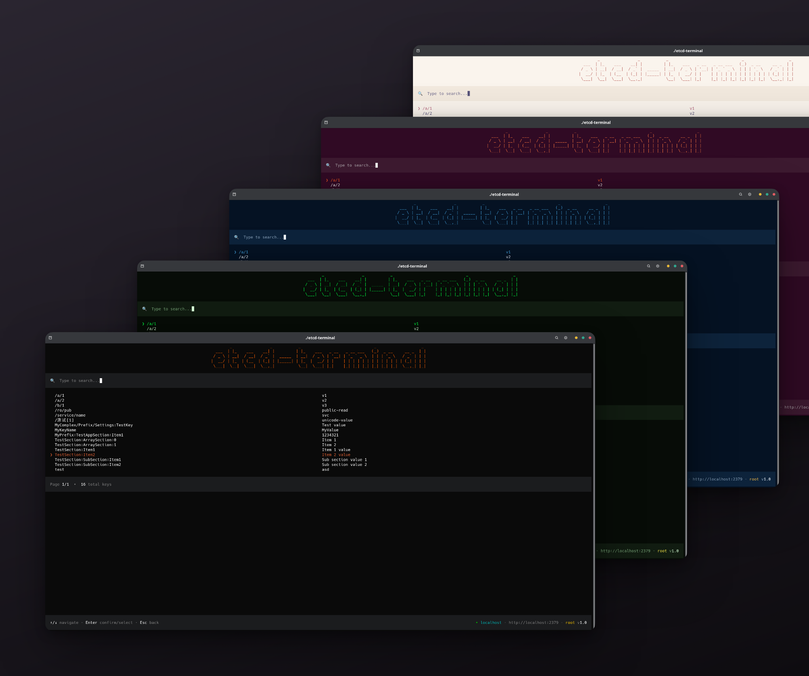
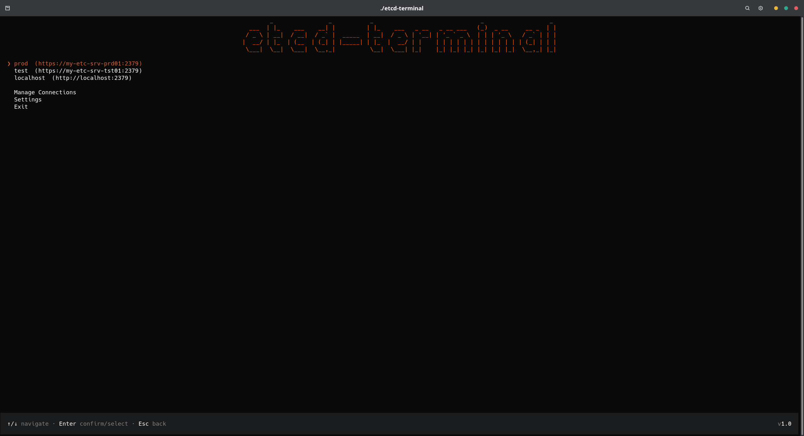
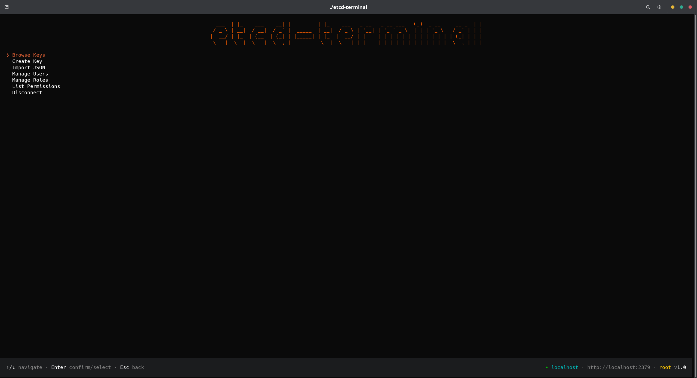
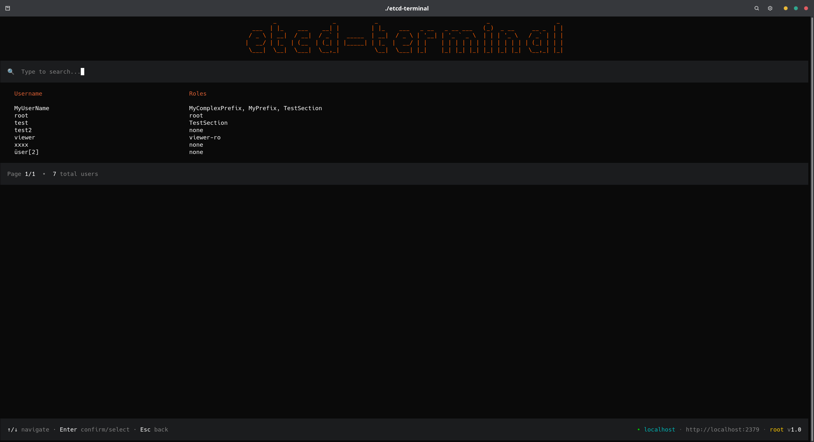
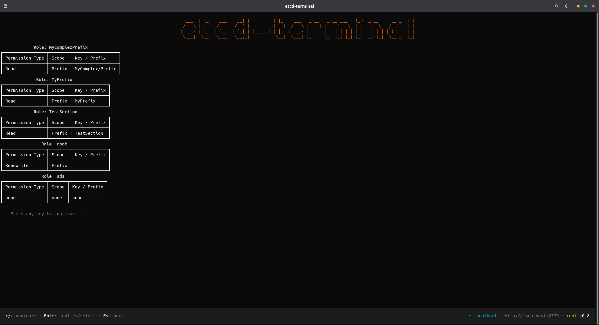

# etcd-terminal


**etcd-terminal** is an interactive terminal client for managing etcd v3+ clusters. It uses a text UI built with Spectre.Console.

[](https://github.com/SimplifyNet/etcd-terminal/releases)
[](https://github.com/SimplifyNet/etcd-terminal/blob/master/LICENSE)



## Features

### Connection management
- Save multiple named instances and select one when the app starts
- Add, edit, remove, and reorder saved instances
- Connect over HTTP or HTTPS, with optional username/password authentication
- Saved passwords are encrypted in the configuration file

### Key and value management
- **Browse** — view readable keys in a paginated list; available keys respect the connected account's permissions
- **Search** — filter the loaded list locally by key or value, without case sensitivity
- **Create** — add a key and value
- **Edit / delete** — change or remove a selected key when the account has write access to it
- **Import JSON** — paste a JSON object or array, choose a key separator and optional prefix, preview the resulting keys, then confirm import; nested objects and arrays are flattened into keys

### User and role management (RBAC)
- **Users** — list, create, delete, change passwords, and assign or remove roles
- **Roles** — list, create, and delete roles
- **Permissions** — grant or revoke read, write, or read/write access to a key or key prefix
- **Permission overview** — browse the effective user-to-role-to-permission assignments
- Authentication management is available when authentication is disabled or the connected account has the etcd root role; key actions are limited to the permissions of the connected account

### Preferences
- Choose the interface language: English, Russian, or Chinese
- Choose from the built-in color themes
- Set the page size (1-500 items) and whether input values are trimmed
- Preferences are saved alongside connection configuration

## Screenshots

### Instance selection



### Main menu



### Users



### Roles



## Configuration

Configuration and preferences are stored in `~/.config/etcd-terminal/config.json`
under the current user's home directory (for example, `%USERPROFILE%\.config\etcd-terminal\config.json` on Windows).

Example configuration:

```json
{
  "Instances": [
    {
      "Name": "Local etcd",
      "ConnectionString": "http://localhost:2379"
    },
    {
      "Name": "Secured cluster",
      "ConnectionString": "https://etcd.example.com:2379",
      "Username": "admin"
    }
  ]
}
```

Add or edit connections in the app to save a password. Passwords are encrypted,
but the encryption key is stored next to the configuration (`.key` in the same
directory). This helps protect against other local users, but not anyone who can
read your home directory.

## Performance notes

- Key browsing loads all keys readable by the connected account before filtering and pagination. On large keyspaces, loading and local search may be slow.
- User and role listings make one etcd request per listed entry in addition to the initial list request.
- Import writes keys individually. If it is cancelled or an entry fails, earlier successful writes are not rolled back.

## Requirements

- etcd v3+
- .NET 10.0 Runtime (or the .NET 10.0 SDK to run from source)

## Building

Requires the [.NET 10.0 SDK](https://dotnet.microsoft.com/download).

```bash
dotnet build src/EtcdTerminal.slnx
```

## Running the App

### From source

```bash
dotnet run --project src/EtcdTerminal.App/EtcdTerminal.App.csproj
```

### Release build

Requires the [.NET 10.0 Runtime](https://dotnet.microsoft.com/download/dotnet/10.0), unless publishing as a self-contained application.

```bash
dotnet publish src/EtcdTerminal.App/EtcdTerminal.App.csproj -c Release -o out
./out/etcd-terminal
```
